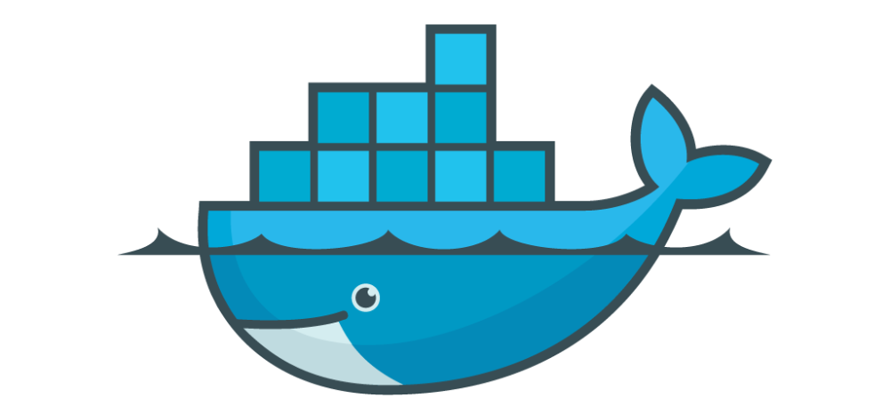
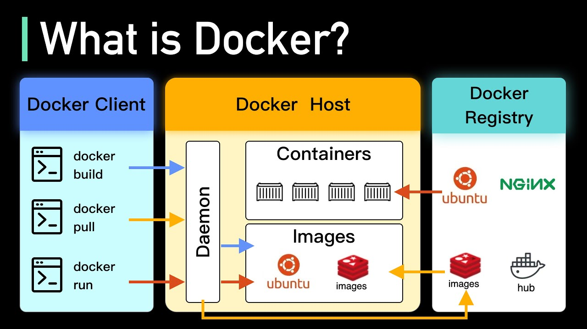
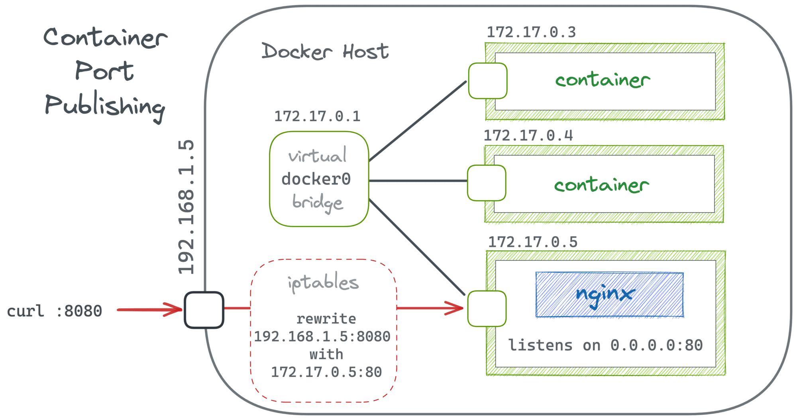

# Docker Documentation

## Indice
1. [Fundamentos de Docker](#fundamentos-de-docker)
    1. [Que es Docker](#que-es-docker)
    2. [Instalación de Docker Desktop](#instalación-de-docker-desktop)
    3. [Conceptos básicos](#conceptos-básicos)
    4. [Ciclo de vida de un contenedor](#ciclo-de-vida-de-un-contenedor)
    5. [Diferencias entre contenedores y máquinas virtuales](#diferencias-entre-contenedores-y-máquinas-virtuales)
    6. [Networking en Docker](#networking-en-docker)

## Fundamentos de Docker
### Que es Docker
Docker es una plataforma de software que permite empaquetar aplicaciones y sus dependencias en contenedores. Un contenedor es una unidad liviana, autónoma y ejecutable que contiene todo lo necesario para ejecutar una aplicación, como el código, las bibliotecas, las herramientas y otras dependencias del sistema. Esto garantiza que la aplicación funcione de manera consistente sin importar el entorno en el que se ejecute, ya sea en una computadora local, en un servidor o en la nube.



### Instalación de Docker Desktop
Seguir la guía oficial de instalación:
https://docs.docker.com/desktop/install/windows-install/

No olvide habilitar la virtualización de hardware en BIOS. Documentación detallada en el siguiente enlace:
https://docs.docker.com/desktop/troubleshoot/topics/#virtualization

### Conceptos básicos
* **Imágenes:** Plantillas de solo lectura utilizadas para crear contenedores. Contienen todo lo necesario para ejecutar una aplicación, incluyendo sistema operativo, bibliotecas y código.

* **Contenedores:** Entornos ligeros y portátiles que ejecutan una imagen. Incluyen todo lo necesario para ejecutar una aplicación, como código, bibliotecas y dependencias.

* **Docker Engine:** Plataforma que permite crear, gestionar y ejecutar contenedores Docker.

* **Docker Hub:** Repositorio en la nube donde se almacenan y comparten imágenes Docker.

* **Dockerfile:** Archivo de texto que contiene instrucciones para crear una imagen Docker, definiendo el entorno, dependencias y comandos a ejecutar en el contenedor.

* **Docker Compose:** Herramienta para definir y ejecutar aplicaciones multi-contenedor Docker mediante un archivo YAML que configura servicios, redes y volúmenes.

* **Docker Swarm:** Herramienta de orquestación que gestiona y escala contenedores Docker como una única aplicación.

* **Kubernetes:** Plataforma de código abierto para automatizar la implementación, escalado y gestión de aplicaciones en contenedores, administrando clústeres de forma eficiente.

### Ciclo de vida de un contenedor
El ciclo de vida de un contenedor de Docker sigue una serie de pasos que permiten crear, ejecutar, gestionar y eliminar contenedores.

* **Crear:** Utilizas el comando docker create para crear un contenedor.
```bash
docker create -p <puertos> --name <nombre_contenedor> <imagen>
```

* **Ejecutar:** Después de crear el contenedor, se inicia el proceso de ejecución con el comando docker start. También es posible usar **docker run** para crear y ejecutar en un solo paso.
```bash
docker start <contenedor_id>
```
```bash
docker run -p <puertos> --name <nombre_contenedor> <imagen>
```

* **Detener:** El contenedor puede ser detenido en cualquier momento con el comando docker stop. Si el contenedor no se detiene de inmediato, se puede usar docker kill, que fuerza la terminación del contenedor.
```bash
docker stop <contenedor_id>
```
```bash
docker kill <contenedor_id>
```

* **Eliminar:** Después de detenerlo, el contenedor puede ser eliminado para liberar recursos, utilizando el comando docker rm.
```bash
docker rm <contenedor_id>
```

## Diferencias entre contenedores y máquinas virtuales
* Arquitectura:
    * VMs: Cada máquina virtual incluye un sistema operativo completo y se ejecuta sobre un hipervisor.
    * Contenedores: Comparten el mismo sistema operativo y kernel del host, solo incluyen las dependencias necesarias para la aplicación.

* Rendimiento:
    * VMs: Más pesadas, requieren más recursos y tiempo de arranque.
    * Contenedores: Ligeros, rápidos, consumen menos recursos y se inician rápidamente.

* Aislamiento:
    * VMs: Aislamiento completo entre sistemas operativos independientes.
    * Contenedores: Aislamiento a nivel de procesos, comparten el kernel del sistema operativo.

* Portabilidad:
    * VMs: Menos portátiles, dependen del hipervisor.
    * Contenedores: Muy portátiles, se pueden ejecutar en cualquier entorno con Docker.

* Gestión y Escalabilidad:
    * VMs: Más complejas de gestionar y escalar debido a su sobrecarga de recursos.
    * Contenedores: Faciles de gestionar y escalar, ideales para aplicaciones distribuidas y microservicios.

## Networking en Docker
Docker proporciona un sistema de redes altamente configurable para permitir que los contenedores se comuniquen entre sí y con el mundo exterior. Docker usa su propio motor de redes basado en namespaces de red de Linux y iptables para gestionar la conectividad.

### Tipos de Redes en Docker
Docker ofrece varios controladores de red (drivers) para diferentes escenarios:

1. **Bridge (Por defecto):** Es el tipo de red predeterminado cuando se inicia un contenedor sin especificar una red. Permite la comunicación entre contenedores en el mismo host, pero no con otros hosts. Utiliza un NAT (Network Address Translation) para permitir el acceso a internet. Se pueden conectar varios contenedores al mismo bridge manualmente.

```bash
docker network create --driver bridge <mi_red_bridge>
docker network connect <mi_red_bridge> <mi_contenedor>
```



2. **Host:** Usa la red del host directamente sin aislamiento. No crea una interfaz de red separada para el contenedor. Útil cuando se necesita el mejor rendimiento de red.

```bash
docker run --network host nginx
```

3. **None:** Deshabilita por completo la red del contenedor. Útil para tareas que no requieren conexión a la red.

```bash
docker run --network none busybox
```

4. **Overlay:** Permite la comunicación entre contenedores en múltiples hosts dentro de un clúster de Docker Swarm. Requiere Docker Swarm para funcionar. Usa VXLAN para crear redes virtuales distribuidas.

```bash
docker network create --driver overlay <mi_red_overlay>
```

5. **Macvlan:** Permite asignar direcciones IP únicas a los contenedores dentro de la red física. Se comporta como si cada contenedor fuera un dispositivo físico en la red. Ideal para aplicaciones que requieren una dirección IP específica (como servidores DHCP o aplicaciones legadas).

```bash
docker network create -d macvlan \
  --subnet=192.168.1.0/24 \
  --gateway=192.168.1.1 \
  -o parent=eth0 mi_red_macvlan
```

### DNS en Docker
Docker usa un DNS interno para la resolución de nombres dentro de redes bridge y overlay, permitiendo que los contenedores se comuniquen sin conocer las IPs.

Para definir un DNS personalizado:
```bash
docker run --dns=8.8.8.8 ubuntu
```

### Ejemplo de redes en Docker Compose
Docker Compose permite definir redes de manera declarativa. Los servicios dentro de mi_red podrán comunicarse entre sí por nombre.
```yaml
version: "3.8"
services:
  web:
    image: nginx
    networks:
      - mi_red
  app:
    image: myapp
    networks:
      - mi_red

networks:
  mi_red:
    driver: bridge
```

## Comandos básicos
### Trabajar con imagenes
* Listar las imágenes
```shell
docker image ls
```

* Crea y ejecuta un nuevo contenedor a partir de una imagen
```shell
docker run -p 9092:9092 --name <nombre_contenedor> <image_id>
```

### Trabajar con contenedores
* Mostar los contenedores en cualquier estado
```shell
docker ps -a
```

* Mostar los contenedores en ejecución
```shell
docker ps
```

* Inicializar un contenedor detenido
```shell
docker start <nombre_contenedor o id_contenedor>
```

* Detener un contenedor
```shell
docker stop <nombre_contenedor o id_contenedor>
```

* Detener todos los contenedores
```shell
docker stop $(docker ps -q)
```

* Mostrar el log de la aplicación
```shell
docker logs <nombre_contenedor o id_contenedor>
```

## Compresión de imagenes
### Guardar la imagen como un archivo .tar
Usa el comando docker save para exportar la imagen a un archivo .tar:
```bash
docker save -o nombre_archivo.tar nombre_imagen:tag
```

### Cargar una imagen en .tar con
Imaginemos que tenemos un archivo **myimage.tar** y quieres que la imagen se etiquete como **myapp:latest**. Aquí está el flujo completo:

1. Cargar la imagen:
```bash
docker load -i myimage.tar
```

2. Listar las imágenes para encontrar el IMAGE ID:
```bash
docker images
```
Supongamos que el **IMAGE ID** es **abc123**.

3. Renombrar y etiquetar la imagen:
```bash
docker tag abc123 myapp:latest
```