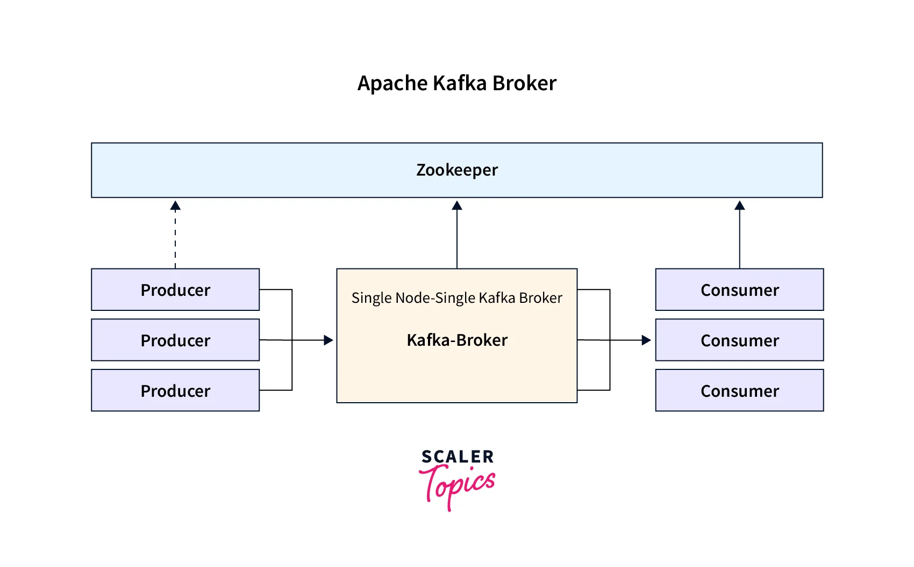
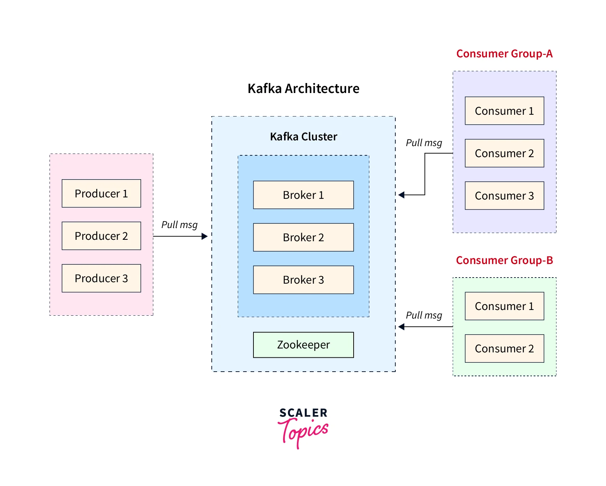
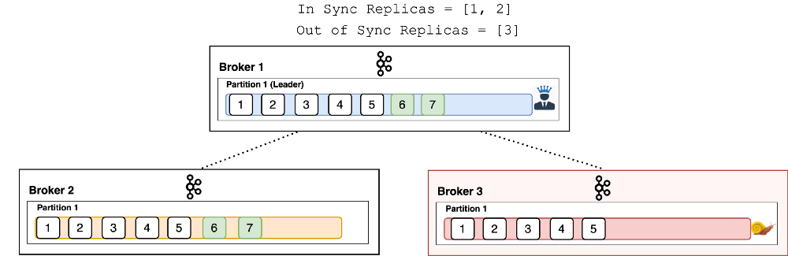

# Kafka
1. [Arquitectura de Kafka](#arquitectura-de-kafka)
    1. [Componentes principales](#componentes-principales)
    2. [Replicación y tolerancia a fallos](#replicación-y-tolerancia-a-fallos)
    3. [Logs y almacenamiento](#logs-y-almacenamiento)
2. [Productores y Consumidores](#productores-y-consumidores)
    1. [Productores](#productores)
    2. [Consumidores](#consumidores)
3. [Modelado de Datos en Kafka](#modelado-de-datos-en-kafka)
    1. [Estructura y formato de mensajes](#estructura-y-formato-de-mensajes)
    2. [Diseño de Topics](#diseño-de-topics)
4. [Monitoreo y Operaciones](#monitoreo-y-operaciones)
    1. [Métricas clave de Kafka](#métricas-clave-de-kafka)
    2. [Herramientas de monitoreo](#herramientas-de-monitoreo)
    3. [Diagnóstico y solución de problemas](#diagnóstico-y-solución-de-problemas)
5. [Seguridad en Kafka](#seguridad-en-kafka)
    1. [Autenticación y Autorización](#autenticación-y-autorización)
    2. [Seguridad en datos](#seguridad-en-datos)
6. [Integración y Ecosistema Kafka](#integración-y-ecosistema-kafka)
    1. [Kafka Connect](#kafka-connect)
    2. [Kafka Streams](#kafka-streams)
    3. [ksqlDB](#ksqldb)
7. [Optimización de Rendimiento](#optimización-de-rendimiento)
    1. [Configuración de Brokers](#configuración-de-brokers)
    2. [Configuración de Productores y Consumidores](#configuración-de-productores-y-consumidores)
    3. [Escalabilidad y particionamiento](#escalabilidad-y-particionamiento)
8. [Escenarios Avanzados](#escenarios-avanzados)
    1. [Garantías de Entrega](#garantías-de-entrega)
    2. [Manejo de fallos y recuperación](#manejo-de-fallos-y-recuperación)
9. [Casos de Uso y Patrones de Diseño](#casos-de-uso-y-patrones-de-diseño)
    1. [Event Sourcing y CQRS con Kafka](#event-sourcing-y-cqrs-con-kafka)
    2. [Real-Time Analytics y Data Pipelines](#real-time-analytics-y-data-pipelines)
    3. [IoT y Mensajería Asíncrona](#iot-y-mensajería-asíncrona)
10. [Comunidad y Recursos](#comunidad-y-recursos)

## Arquitectura de Kafka
### Componentes principales

#### Broker
El **broker** es el servidor dentro del clúster de Kafka que recibe, almacena y distribuye los mensajes. Su función principal es gestionar las operaciones de lectura y escritura de datos en los **topics**, asegurando la disponibilidad y distribución de los datos. Los brokers se comunican entre sí para balancear la carga y replicar datos, garantizando así la tolerancia a fallos.

#### Zookeeper
Apache Kafka utiliza **Zookeeper** para la gestión de metadatos y coordinación del clúster. Sus principales funciones incluyen:

* Mantener la información sobre los **brokers activos** y su estado.
* Gestionar la elección del **líder de partición**, asegurando que siempre haya un broker coordinando la escritura y lectura de datos.
* Almacenar configuraciones de tópicos y controladores de acceso.

#### Topics y Partitions
Los datos en Kafka se organizan en **topics**, que actúan como canales de comunicación. Cada topic se divide en múltiples **partitions**, lo que permite la distribución de la carga y el procesamiento paralelo. Cada partición se almacena en uno o más brokers y sigue una estrategia de replicación para garantizar disponibilidad y durabilidad.

#### Producers y Consumers
Los **producers** son los encargados de enviar datos a los topics en Kafka. Pueden escribir mensajes en una o varias particiones, dependiendo de la estrategia de particionado utilizada. Los **consumers**, por otro lado, leen los mensajes de las particiones y procesan los datos. Cada consumidor pertenece a un **Consumer Group**, lo que permite un procesamiento balanceado de la información.

#### Consumer Groups
Los **Consumer Groups** permiten distribuir la carga de procesamiento entre múltiples consumidores. Kafka asigna automáticamente las particiones entre los consumidores de un mismo grupo, asegurando que cada mensaje sea leído solo una vez por un consumidor dentro del grupo. Esto facilita la concurrencia y la escalabilidad en el procesamiento de datos.

### Replicación y tolerancia a fallos
#### Replication Factor
Kafka soporta la replicación de particiones para garantizar la tolerancia a fallos. El **Replication Factor** define cuántas copias de una partición existen en el clúster. Un mayor número de réplicas mejora la disponibilidad, pero también incrementa el uso de almacenamiento y la complejidad del clúster.

#### ISR (In-Sync Replicas)
El conjunto de **In-Sync Replicas (ISR)** está formado por las réplicas que están completamente sincronizadas con el líder. Kafka solo considera que un mensaje ha sido confirmado cuando es replicado en todos los ISR, lo que mejora la durabilidad pero puede afectar la latencia si hay muchas réplicas.

#### Leader y Followers
Cada partición en Kafka tiene un **líder**, que maneja todas las operaciones de lectura y escritura. Los **followers** replican los datos desde el líder y pueden asumir su rol en caso de fallo. Si un líder falla, Zookeeper coordina la elección de un nuevo líder a partir de los ISR disponibles.

### Logs y almacenamiento
#### Estructura de almacenamiento de Kafka
Kafka almacena los datos en **logs segmentados**, donde cada partición se representa como un conjunto de archivos de log. Los mensajes se escriben secuencialmente en estos logs, lo que maximiza el rendimiento y la eficiencia del almacenamiento en disco.

#### Retention Policy
Kafka permite configurar una **política de retención** para determinar cuánto tiempo o cuántos datos pueden almacenarse en un topic antes de ser eliminados. Se puede definir la retención en función de:
* Tiempo (por ejemplo, 7 días).
* Tamaño del almacenamiento (por ejemplo, 10 GB por partición).
* Ambos criterios combinados.

#### Compaction de logs
La **compaction de logs** es una estrategia de almacenamiento que mantiene solo la última versión de cada clave en un topic. Es útil en casos donde se requiere mantener un estado actualizado de los datos sin necesidad de retener todo el historial de mensajes.

## Productores y Consumidores
### Productores
#### Batching y Compresión
Para mejorar el rendimiento, Kafka permite el uso de **batching**, donde múltiples mensajes se agrupan antes de ser enviados, reduciendo la sobrecarga de red. Además, la **compresión** (GZIP, Snappy, LZ4, ZSTD) puede usarse para reducir el tamaño de los mensajes y optimizar el almacenamiento y transmisión de datos.

#### Acks (Acknowledgments)
Los **acknowledgments (acks)** determinan cómo el productor maneja la confirmación de entrega de los mensajes:
* **acks=0:** No espera confirmación, lo que mejora el rendimiento pero puede provocar pérdida de mensajes.
* **acks=1:** Espera confirmación solo del líder, ofreciendo un equilibrio entre rendimiento y seguridad.
* **acks=all:** Espera confirmación de todos los ISR, garantizando mayor durabilidad pero con posible impacto en la latencia.

#### Partitioning Strategies
Kafka permite diferentes estrategias de particionado:
* **Default:** Kafka asigna automáticamente la partición.
* **Key-based:** Usa una clave específica para garantizar que los mensajes con la misma clave siempre vayan a la misma partición.
* **Custom:** Se puede definir una estrategia personalizada de particionado.

#### Idempotent Producer
El **Idempotent Producer** permite a Kafka evitar la duplicación de mensajes, asegurando que un mensaje solo se registre una vez, incluso en caso de reintentos.

#### Transactional Producer
El **Transactional Producer** garantiza la **exactly-once semantics**, lo que significa que los mensajes se entregan exactamente una vez, incluso en escenarios con múltiples particiones o fallos intermitentes.

### Consumidores
#### Offset Management
Los consumidores deben gestionar su **offset**, que indica qué mensajes han sido procesados. Kafka permite:
* **Commit automático:** Kafka guarda automáticamente el último offset leído.
* **Commit manual:** El consumidor decide cuándo confirmar la lectura de los mensajes, evitando pérdidas o duplicaciones.

#### Consumer Polling
El proceso de **polling** permite a los consumidores recuperar mensajes desde Kafka. Se recomienda mantener un intervalo de polling adecuado para evitar que el consumidor sea expulsado del grupo.

#### Rebalanceo de consumidores
El **rebalanceo de consumidores** ocurre cuando un consumidor entra o sale de un **Consumer Group**. Para minimizar su impacto, se pueden aplicar estrategias como **Sticky Assignor**, que mantiene las asignaciones previas, reduciendo la interrupción en el procesamiento.

#### Processing Guarantees
Kafka ofrece distintos niveles de garantías en el procesamiento de mensajes:
* **At-most-once:** Los mensajes pueden perderse, pero nunca se procesan dos veces.
* **At-least-once:** Garantiza que todos los mensajes se procesen al menos una vez, aunque pueda haber duplicaciones.
* **Exactly-once:** Garantiza que los mensajes se procesen una única vez, evitando duplicaciones y pérdidas.

## Modelado de Datos en Kafka
### Estructura y formato de mensajes
#### Key-value
Los mensajes en Kafka se estructuran como pares **key-value**, donde la clave determina la partición a la que se asigna el mensaje, y el valor contiene los datos.

#### Formatos de serialización
Kafka soporta diferentes formatos de serialización, como **JSON, Avro y Protobuf**, cada uno con ventajas en términos de flexibilidad y eficiencia.

#### Schema Evolution
El uso de **Schema Registry** permite gestionar la evolución de esquemas en Kafka, asegurando la compatibilidad entre versiones de mensajes.

### Diseño de Topics
#### Convenciones de nomenclatura de topics
Se recomienda seguir estándares de nomenclatura claros y consistentes para facilitar la administración.

#### Granularidad de los topics
Se debe decidir entre **topics monolíticos o específicos** en función de la separación lógica de datos.

#### Partitioning Strategy
El particionado debe basarse en claves de negocio relevantes para optimizar la distribución de la carga.

## Monitoreo y Operaciones
### Métricas clave de Kafka
El monitoreo de Kafka es esencial para garantizar un rendimiento óptimo. Algunas métricas clave incluyen:
* **Latencia de producción y consumo:** Mide el tiempo que tarda un mensaje en ser enviado por un productor y consumido por un consumidor.
* **Lag en Consumer Groups:** Indica cuántos mensajes aún no han sido procesados por los consumidores, ayudando a detectar posibles cuellos de botella.
* **Throughput y tasa de error:** Evalúa la cantidad de mensajes procesados por segundo y la tasa de fallos en productores y consumidores.

### Herramientas de monitoreo
Para visualizar y analizar métricas en Kafka, se pueden utilizar varias herramientas:
* **Confluent Control Center, AKHQ y Kafka Manager:** Proveen interfaces gráficas para administrar y monitorear clústeres de Kafka.

* **Prometheus + Grafana:** Permiten extraer y visualizar métricas clave de Kafka de manera personalizada.

* **JMX (Java Management Extensions):** Proporciona métricas detalladas sobre el rendimiento y estado de los brokers.

### Diagnóstico y solución de problemas
Algunos problemas comunes en Kafka y sus soluciones incluyen:
* **Lags altos en consumidores:** Se pueden mitigar aumentando la cantidad de consumidores o ajustando la configuración de procesamiento.
* **Rebalanceo frecuente de Consumer Groups:** Puede indicar configuraciones ineficientes en el polling o tiempos de sesión demasiado cortos.
* **Fallas en brokers:** Es importante revisar logs y monitorear métricas de salud del clúster para identificar problemas de recursos o conectividad.

## Seguridad en Kafka
### Autenticación y Autorización
Kafka ofrece varios mecanismos para garantizar que solo usuarios y servicios autorizados accedan a los datos:
* **SSL/TLS:** Cifra la comunicación entre productores, consumidores y brokers, evitando ataques de intermediario (MITM).
* **SASL (Kerberos, SCRAM, OAUTH):** Proporciona autenticación robusta para los clientes de Kafka.
* **ACLs (Access Control Lists):** Definen qué usuarios o aplicaciones pueden acceder a topics, evitando accesos no autorizados.

### Seguridad en datos
Además del acceso seguro, Kafka permite proteger los datos almacenados:
* **Cifrado en reposo:** Protege la información almacenada en discos mediante tecnologías como AES o herramientas de terceros.
* **Gestión de credenciales y secretos:** Es recomendable utilizar sistemas como HashiCorp Vault o AWS Secrets Manager para administrar credenciales de acceso de forma segura.

## Integración y Ecosistema Kafka
### Kafka Connect
Kafka Connect facilita la integración con otros sistemas a través de conectores preconstruidos:
* **Conectores fuente y sink:** Permiten importar y exportar datos desde bases de datos (JDBC), sistemas de almacenamiento (S3, HDFS) y motores de búsqueda (Elasticsearch).
* **Configuración y escalabilidad:** Se pueden distribuir múltiples tareas de un conector en diferentes nodos para mejorar el rendimiento.
* **Transformaciones con Single Message Transforms (SMT):** Permiten modificar mensajes en vuelo antes de que lleguen a su destino.

### Kafka Streams
Kafka Streams es una API para el procesamiento de datos en tiempo real dentro de Kafka:
* **Procesamiento Stateless vs. Stateful:** Stateless no mantiene estado entre eventos, mientras que Stateful almacena información para cálculos más complejos.
* **Uso de KTables y Windowing:** KTables permiten manejar estados de agregación, y Windowing agrupa eventos en ventanas temporales para análisis eficiente.

### ksqlDB
ksqlDB permite interactuar con flujos de datos usando SQL:
* **Ejecutar consultas SQL sobre flujos de Kafka:** Facilita el procesamiento en tiempo real sin necesidad de programación compleja.
* **Integraciones con sistemas OLAP y BI:** Permite conectar Kafka con herramientas analíticas como Apache Druid o ClickHouse para generar reportes y dashboards en tiempo real.

## Optimización de Rendimiento
### Configuración de Brokers
Optimizar los brokers de Kafka es clave para maximizar el rendimiento y la estabilidad del clúster. Algunas configuraciones importantes incluyen:
* **Heap Size y Garbage Collection tuning:** Ajustar el tamaño de la memoria heap de JVM (KAFKA_HEAP_OPTS) y optimizar la recolección de basura (GC) para minimizar pausas y mejorar la latencia.
* **Configuración de discos y almacenamiento eficiente:** Usar discos SSD y sistemas de archivos optimizados (XFS o EXT4) mejora la velocidad de escritura y lectura de logs.
* **Impacto del replication factor:** Aumentar el número de réplicas mejora la tolerancia a fallos, pero incrementa la latencia y el uso de almacenamiento.

### Configuración de Productores y Consumidores
Ajustar parámetros en productores y consumidores puede reducir la latencia y aumentar la eficiencia:

#### Productores:
* **linger.ms:** Retrasa el envío de mensajes para agruparlos en lotes más grandes.
* **batch.size:** Determina el tamaño de los lotes de mensajes enviados.
* **compression.type:** Usar snappy o lz4 reduce el uso de ancho de banda.

#### Consumidores:
* **fetch.min.bytes:** Indica el tamaño mínimo de datos que un consumidor debe recibir antes de procesar mensajes.
* **fetch.max.wait.ms:** Tiempo máximo que un consumidor espera antes de recibir nuevos datos.

### Escalabilidad y particionamiento
Para garantizar el crecimiento eficiente del clúster:
* **Número óptimo de particiones:** Depende del número de consumidores y la capacidad del clúster; más particiones permiten mayor concurrencia, pero aumentan la sobrecarga de administración.
* **Escalado de consumidores:** Se recomienda mantener el número de consumidores igual o menor al número de particiones para evitar que algunos consumidores queden inactivos.

## Escenarios Avanzados
### Garantías de Entrega
Kafka ofrece distintos mecanismos para asegurar la entrega confiable de mensajes:
* **Exactly-Once Processing con Kafka Transactions:** Evita la duplicación de mensajes al escribir en múltiples topics de manera atómica.
* **Atomicidad y consistencia en Kafka Streams:** Uso de *Kafka Streams* y su mecanismo de estado para garantizar la consistencia en el procesamiento de datos.

### Manejo de fallos y recuperación
Estrategias para garantizar la disponibilidad y recuperación de datos en caso de fallos:
* **Disaster Recovery con replicación entre data centers:** Replicar datos en múltiples regiones para minimizar el impacto de fallos críticos.
* **Cross-Cluster Mirroring con MirrorMaker 2.0:** Permite sincronizar topics entre clústeres de Kafka, asegurando redundancia y continuidad operativa.

## Casos de Uso y Patrones de Diseño
### Event Sourcing y CQRS con Kafka
Kafka es una excelente opción para arquitecturas **event-driven** y patrones como **CQRS** (Command Query Responsibility Segregation):
* **Modelado de eventos en Kafka:** Los eventos representan cambios en el estado de un sistema y pueden ser almacenados en Kafka para su posterior reproducción.
* **Uso en arquitecturas orientadas a eventos:** Kafka permite desacoplar servicios, mejorando la escalabilidad y resiliencia del sistema.

### Real-Time Analytics y Data Pipelines
Kafka es clave en **procesamiento de datos en tiempo real** y **ETL en streaming**:
* **Integración con herramientas de Big Data:** Frameworks como **Apache Flink, Spark Streaming y Snowflake** pueden consumir datos de Kafka para análisis en tiempo real.
* **Ingestión de datos con Kafka Connect:** Facilita la carga de datos desde y hacia bases de datos, almacenamiento en la nube y otras plataformas.

### IoT y Mensajería Asíncrona
Kafka se usa ampliamente en sistemas **IoT y comunicación entre dispositivos**:
* **Diseño de arquitecturas escalables para IoT:** Kafka permite manejar millones de eventos por segundo, facilitando la integración con sistemas de sensores y dispositivos inteligentes.
* **Kafka vs. MQTT en arquitecturas de mensajería:** Mientras **MQTT** es ideal para dispositivos de baja latencia y bajo consumo de energía, **Kafka** es más robusto para manejar grandes volúmenes de datos con persistencia y escalabilidad.

## Comunidad y Recursos
### Recursos usados:
- https://www.scaler.com/topics/kafka-broker/
- https://accu.org/journals/overload/28/159/kozlovski/