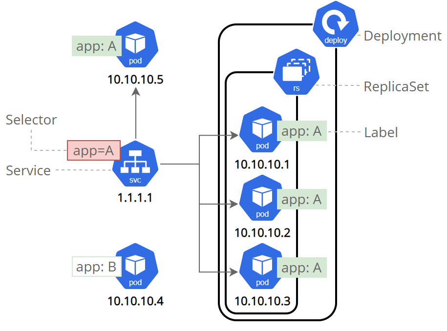
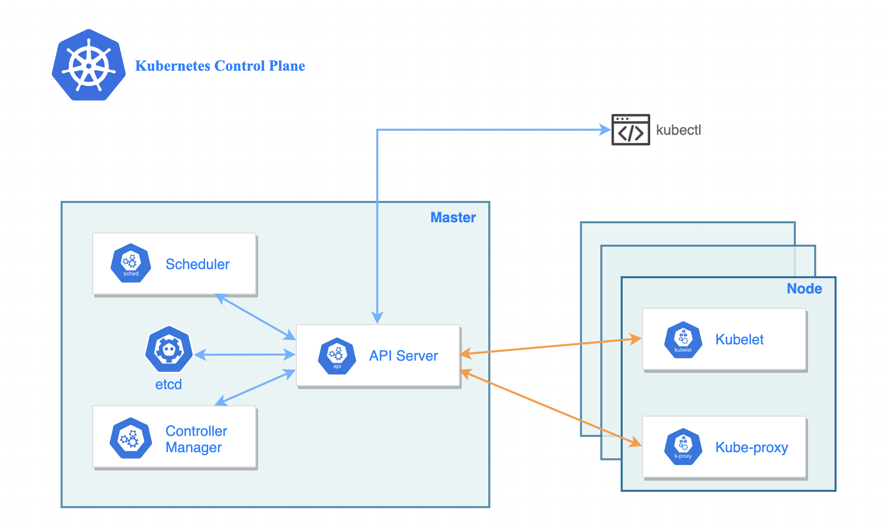
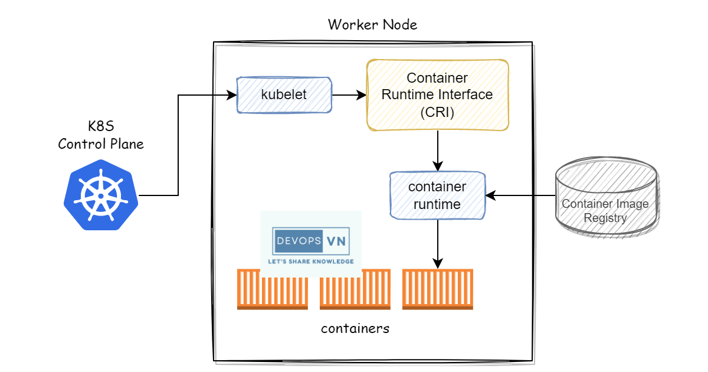
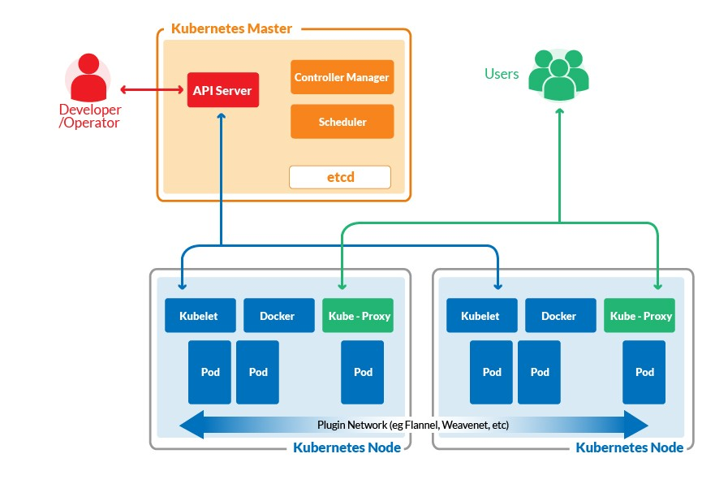

## Indice
1. [Fundamentos de Kubernetes](#fundamentos-de-kubernetes)
    1. [Conceptos clave](#conceptos-clave)
    2. [Arquitectura de Kubernetes](#arquitectura-de-kubernetes)
2. [Instalación y Configuración](#instalación-y-configuración)
    1. [Minikube vs. Kind vs. K3s para entornos de desarrollo](#minikube-vs-kind-vs-k3s-para-entornos-de-desarrollo)

## Fundamentos de Kubernetes
### Conceptos clave
* **Pods:** Es la unidad mínima de ejecución en Kubernetes. Agrupan uno o varios contenedores que comparten almacenamiento, red y especificaciones sobre cómo ejecutar los contenedores. Son efímeros, lo que significa que su ciclo de vida es corto y se gestionan a través de objetos de nivel superior como Deployments.
* **Deployments:** Es un objeto de alto nivel que administra el despliegue y la actualización de aplicaciones. Permite definir el estado deseado para los Pods y se encarga de crear o actualizar los recursos necesarios (como ReplicaSets). Facilita actualizaciones continuas y rollbacks en caso de fallos, asegurando la disponibilidad de la aplicación.
* **Services:** Es una abstracción que define un conjunto lógico de Pods y una política de acceso para ellos. Proporciona un único punto de acceso (a menudo mediante un balanceador de carga) para comunicarse con los Pods, sin tener que preocuparse por las direcciones IP cambiantes de los mismos. Permite la exposición interna o externa de las aplicaciones.
* **Namespaces:** Son espacios virtuales dentro de un clúster que permiten la segmentación y aislamiento de recursos. Facilitan la organización de recursos, especialmente en entornos con múltiples equipos o proyectos. Ayudan a gestionar permisos y cuotas de recursos de forma aislada.
* **ConfigMaps:** Son objetos que permiten almacenar datos de configuración no confidenciales en forma de pares clave-valor. Se pueden inyectar en los contenedores como variables de entorno, argumentos de comandos o archivos de configuración. Permiten desacoplar la configuración del código de la aplicación, facilitando la administración y actualización de parámetros sin necesidad de reconstruir la imagen del contenedor.
* **Secrets:** Son objetos similares a los ConfigMaps, pero se utilizan para almacenar información sensible y confidencial (como contraseñas, tokens o claves). Proporcionan un mecanismo seguro para inyectar datos sensibles en los contenedores. Los datos almacenados en un Secret están codificados (por ejemplo, en base64) y se gestionan de manera que se minimicen los riesgos de exposición.

### Arquitectura de Kubernetes
1. **Control Plane Node (Master Node):** Es el nodo responsable de la administración y control del clúster. Sus principales componentes son:
    1. **API Server:** Es el punto de entrada a Kubernetes. Gestiona todas las solicitudes REST y actúa como interfaz para el clúster. Valida y procesa comandos de **kubectl** o herramientas externas. Además, es el componente central de comunicación entre todos los demás componentes del clúster.
    2. **Controller Manager:** Supervisa el estado del clúster y actúa para garantizar que coincida con el estado deseado. Agrupa varios controladores (como Replication Controller, Node Controller y Job Controller) que gestionan tareas como la creación de Pods, la reparación de fallos y el mantenimiento del estado de los recursos.
    3. **Scheduler:** Asigna los Pods a los Worker Nodes según la disponibilidad de recursos. Considera factores como uso de CPU, memoria, restricciones, políticas de afinidad/anti-afinidad y cualquier otro requerimiento o restricción del clúster.
    4. **etcd (Almacén de datos):** Base de datos distribuida clave-valor que almacena el estado y la configuración del clúster. Registra información crítica como el estado de los Pods, redes y otros datos de configuración. Es fundamental para la persistencia y la alta disponibilidad del clúster.

2. **Worker Nodes:** Son los nodos donde se ejecutan las aplicaciones dentro de los Pods. Cada nodo de trabajo contiene los siguientes componentes:
    1. **Kubelet:** Agente que se ejecuta en cada nodo y se comunica con el API Server. Garantiza que los contenedores dentro de los Pods estén en ejecución, saludables y en el estado deseado. Además, interactúa con el container runtime para iniciar y gestionar los contenedores.
    2. **Kube-Proxy:** Gestiona las reglas de red para permitir la comunicación entre los Pods y Services. Configura reglas de **iptables** o **IPVS** para el enrutamiento de tráfico dentro y fuera del clúster, garantizando que las solicitudes de red lleguen a los Pods adecuados.
    3. **Container Runtime:** Se encarga de ejecutar los contenedores (puede ser Docker, containerd, CRI-O, etc.). Interactúa con Kubelet para iniciar, detener y gestionar contenedores, cumpliendo con los requerimientos de Kubernetes mediante la Container Runtime Interface (CRI).

3. **Comunicación entre Control Plane y Worker Nodes**
    1. El **Control Plane Node** asigna cargas de trabajo a los **Worker Nodes**.
    2. Los **Worker Nodes** informan constantemente su estado al **Control Plane Node**, permitiendo que este realice un monitoreo continuo.
    3. La **API Server** maneja las interacciones entre los diferentes componentes del clúster, asegurando que las operaciones se realicen correctamente y que el estado del clúster se mantenga conforme al deseado.

## Instalación y Configuración
### Minikube vs. Kind vs. K3s para entornos de desarrollo
En entornos de desarrollo y pruebas locales, existen diversas opciones para ejecutar Kubernetes de manera ligera y eficiente. Las tres opciones más comunes son **Minikube**, **Kind** y **K3s**, cada una con sus ventajas y particularidades.

#### Minikube
Es una herramienta que permite ejecutar un clúster Kubernetes local en una sola máquina.
* **Características:** Fácil instalación y uso en sistemas operativos Windows, macOS y Linux. Soporta múltiples drivers (VirtualBox, Docker, KVM, etc.). Ideal para aprender y desarrollar en un entorno local sencillo.
* **Ventajas:** Configuración simple y documentación amplia. Permite probar características de Kubernetes sin la complejidad de un clúster completo.

#### Kind
Ejecuta clústeres de Kubernetes usando contenedores Docker como nodos.
* **Características:** Ligero y rápido para crear y destruir clústeres. Es muy útil para pruebas automatizadas e integración continua (CI). Facilita la simulación de clústeres multi-nodo sin requerir máquinas virtuales.
* **Ventajas:** Integración nativa con Docker, lo que lo hace ideal en entornos de desarrollo modernos. Permite la configuración avanzada de nodos para pruebas específicas.

#### K3s
Es una distribución ligera de Kubernetes, optimizada para entornos edge, IoT y desarrollo.
* **Características:** Consumo reducido de recursos y un binario único que simplifica la instalación. Compatible con la mayoría de herramientas y APIs de Kubernetes. Ideal para entornos con recursos limitados y despliegues rápidos.
* **Ventajas:** Fácil de instalar y mantener. Buen rendimiento en hardware modesto o escenarios donde se requiere un clúster ligero.

### Configuración básica y avanzada del *kubeconfig*
#### Configuración Básica del kubeconfig:
Es el archivo de configuración que almacena la información necesaria para que **kubectl** se conecte y autentique en un clúster Kubernetes. Contiene detalles como clusters, usuarios y contextos.

#### Configuración Avanzada del kubeconfig:

### Uso de kubectl y Lens para administración

## Gestión de Aplicaciones en Kubernetes

## Orquestación y Escalabilidad

## Seguridad en Kubernetes

## Observabilidad y Monitoreo

## CI/CD en Kubernetes

## Helm y Operators

## Kubernetes en la Nube

## Kubernetes Avanzado