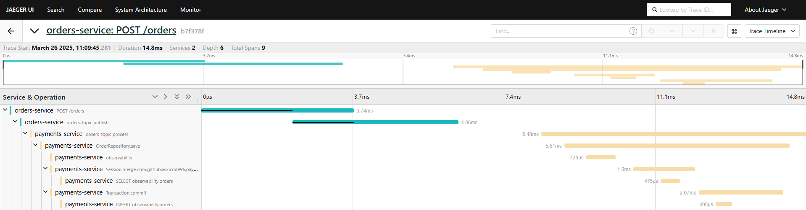

# Observabilidad

## Arrancar el proyecto
1. Para que Kafka sincronice los datos entre los micros instalaremos el modulo **shared-models** con **maven** ejecutando el siguiente comando dentro de su directorio.
```bash
mvn clean install
```

2. Empaquetaremos los micros **orders-service** y **payments-service** ejecutando el siguiente comando **maven** dentro de sus directorios correspondientes.
```bash
mvn clean package
```

3. Ahora podremos levantar la aplicación con **docker-compose**
```bash
docker-compose up -d
```

Si queremos detener la aplicación ejecutaremos el siguiente comando:
```bash
docker-compose down --volumes
```

## Herramientas disponibles
* Swagger del microservicio que crea la ordén: http://localhost:8085/swagger-ui/index.html
* Kafka UI: http://localhost:8081/
* pgAdmin 4: http://localhost:8080/
* Jaeger UI: http://localhost:16686/search

## Probar la aplicación
Si entramos a la dirección de Swagger UI del microservicio de ordenes podremos hacer una petición POST para generar un evento. Ejemplo del cuerpo de la petición:
```json
{
  "product": "manzanas",
  "quantity": 3
}
```

A continuación podemos revisar la traza generada en Jaeger UI donde aparecerán todos los eventos internos (spans) y que micro los ha ejecutado.


| Puerto | Protocolo | Uso                                              |
|--------|-----------|--------------------------------------------------|
| 4317   | gRPC      | Recepción de trazas (traces) usando OTLP en gRPC |
| 4318   | HTTP      | Recepción de trazas (traces) usando OTLP en HTTP |
| 55678  | gRPC      | Recepción de métricas usando OTLP en gRPC        |
| 55679  | HTTP      | Recepción de métricas usando OTLP en HTTP        |
