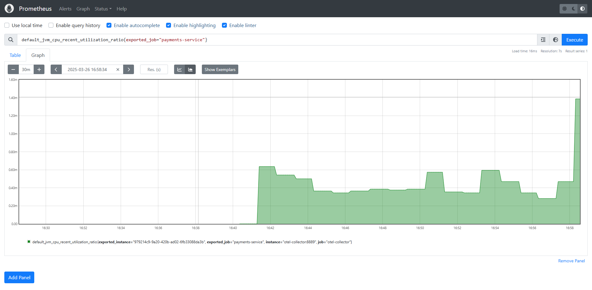
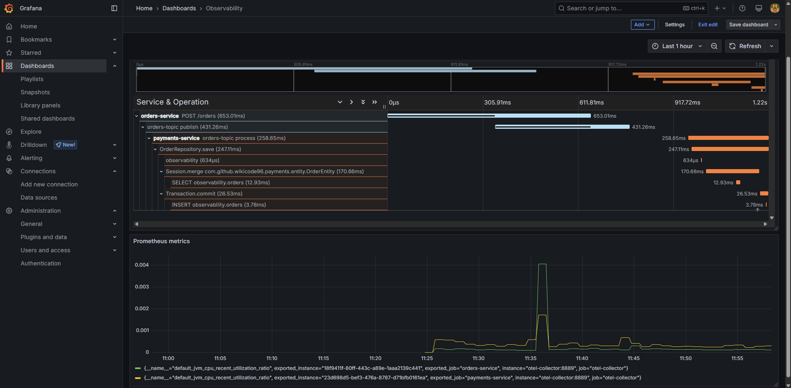

# Observabilidad

## Arrancar el proyecto
1. Para que Kafka sincronice los datos entre los micros instalaremos el modulo **shared-models** con **maven** ejecutando el siguiente comando dentro de su directorio.
```bash
mvn clean install
```

2. Empaquetaremos los micros **orders-service** y **payments-service** ejecutando el siguiente comando **maven** dentro de sus directorios correspondientes.
```bash
mvn clean package
```

3. Ahora podremos levantar la aplicación con **docker-compose**
```bash
docker-compose up -d
```

Si queremos detener la aplicación ejecutaremos el siguiente comando:
```bash
docker-compose down --volumes
```

## Herramientas disponibles
* Swagger del microservicio que crea la ordén: http://localhost:8085/swagger-ui/index.html
* Grafana: http://localhost:3000/
* Kafka UI: http://localhost:8081/
* pgAdmin 4: http://localhost:8080/
* Jaeger UI: http://localhost:16686/search

## Probar la aplicación
Si entramos a la dirección de Swagger UI del microservicio de ordenes podremos hacer una petición POST para generar un evento. Ejemplo del cuerpo de la petición:
```json
{
  "product": "manzanas",
  "quantity": 3
}
```

A continuación podremos revisar los parametros generados por nuestros micros en nuestras herramientas de observabilidad.

1️⃣ Trazas en Jaeger:


2️⃣ Prometheus para metricas:


Para visualizar en conjunto todos estos datos podremos configurar nuestros propios dashboards en Grafana:


## Esquema del proyecto


## OTEL Collector
| Puerto | Protocolo | Uso                                       |
|--------|-----------|-------------------------------------------|
| 4317   | gRPC      | Recepción de trazas usando OTLP en gRPC   |
| 4318   | HTTP      | Recepción de trazas usando OTLP en HTTP   |
| 55678  | gRPC      | Recepción de métricas usando OTLP en gRPC |
| 55679  | HTTP      | Recepción de métricas usando OTLP en HTTP |
