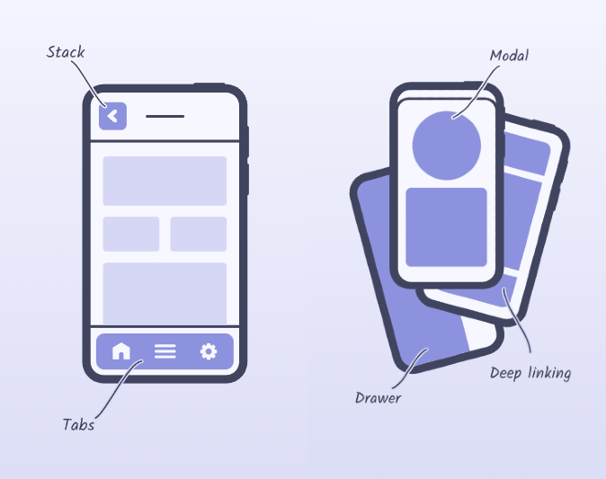

# React Navigation
## Instalar dependencias necesarias
Estas instalaciones están enfocadas al desarrollo usando Expo.
```shell
npm install @react-navigation/native
```
```shell
npx expo install react-native-screens react-native-safe-area-context
```

Documentación oficial: https://reactnavigation.org/docs/getting-started/

## Tipos de navegación y su instalación


Antes de empezar con la implementación de cada navegación es importante explicar que el componente de la navegación tiene que ser envuelto por **NavigationContainer**. Ejemplo simplificado:
```JavaScript
import * as React from 'react';
import { NavigationContainer } from '@react-navigation/native';
import { createDrawerNavigator } from '@react-navigation/drawer';
import HomeScreen from './HomeScreen';
import ProfileScreen from './ProfileScreen';

const Drawer = createDrawerNavigator();

function MyDrawer() {
  return (
    <Drawer.Navigator>
      <Drawer.Screen name="Home" component={HomeScreen} />
      <Drawer.Screen name="Profile" component={ProfileScreen} />
    </Drawer.Navigator>
  );
}

export default function App() {
  return (
    <NavigationContainer>
      <MyDrawer />
    </NavigationContainer>
  );
}
```

Este componente debe envolver el componente raíz de tu aplicación donde defines la navegación principal. **No necesitas envolver cada navegador** (como Stack, Tab, Drawer) individualmente con NavigationContainer.
Ejemplo de navegación anidada:
```JavaScript
import * as React from 'react';
import { NavigationContainer } from '@react-navigation/native';
import { createDrawerNavigator } from '@react-navigation/drawer';
import { createBottomTabNavigator } from '@react-navigation/bottom-tabs';
import HomeScreen from './HomeScreen';
import ProfileScreen from './ProfileScreen';
import SettingsScreen from './SettingsScreen';

const Drawer = createDrawerNavigator();
const Tab = createBottomTabNavigator();

function MyTabs() {
  return (
    <Tab.Navigator>
      <Tab.Screen name="Home" component={HomeScreen} />
      <Tab.Screen name="Settings" component={SettingsScreen} />
    </Tab.Navigator>
  );
}

function MyDrawer() {
  return (
    <Drawer.Navigator>
      <Drawer.Screen name="Tabs" component={MyTabs} /> // Navegación anidada
      <Drawer.Screen name="Profile" component={ProfileScreen} />
    </Drawer.Navigator>
  );
}

export default function App() {
  return (
    <NavigationContainer>
      <MyDrawer />
    </NavigationContainer>
  );
}
```

### Bottom Tab Navigator
Instalar dependencia:
```shell
npm install @react-navigation/bottom-tabs
```

Código de ejemplo:
```JavaScript
import { createBottomTabNavigator } from '@react-navigation/bottom-tabs';

const Tab = createBottomTabNavigator();

function MyTabs() {
  return (
    <Tab.Navigator>
      <Tab.Screen name="Home" component={HomeScreen} />
      <Tab.Screen name="Settings" component={SettingsScreen} />
    </Tab.Navigator>
  );
}
```

https://reactnavigation.org/docs/bottom-tab-navigator/


## Enlaces destacados
* Documentación oficial:
https://reactnavigation.org/

* Video 'React Native Navigation Tutorial para principiantes':
https://www.youtube.com/watch?v=PmILHVEWZUY&t=915s