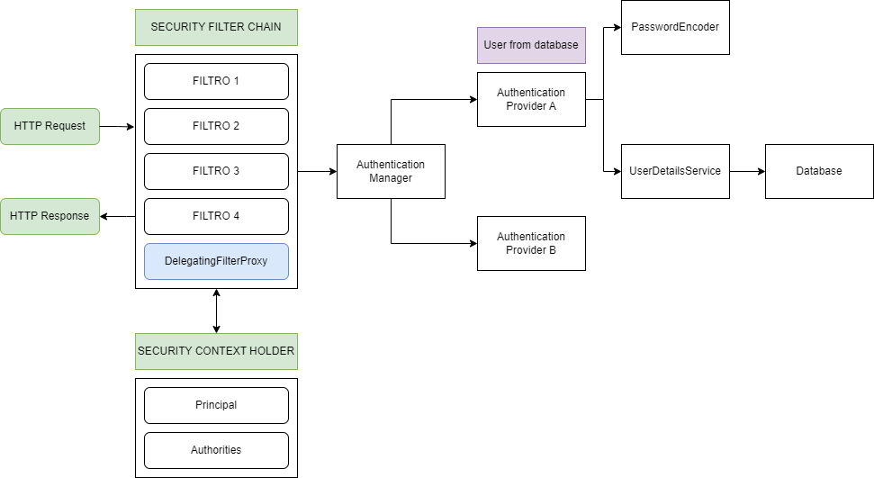
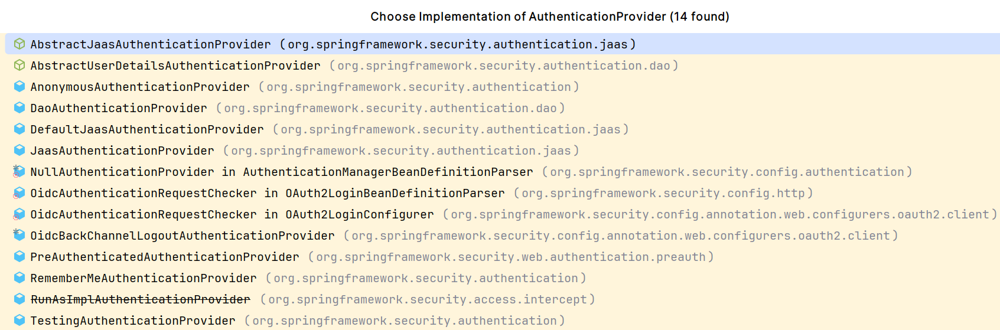

# Spring Security
**Spring Security** es un marco de seguridad ampliamente utilizado en aplicaciones Java, desarrollado como parte del ecosistema Spring. Proporciona una serie de herramientas y configuraciones para gestionar la autenticación y la autorización, permitiendo proteger aplicaciones web y servicios RESTful contra accesos no autorizados. Ofrece integración con diversos métodos de autenticación, como formularios, HTTP Basic, y OAuth2, además de soporte para políticas de autorización a través de roles y permisos, ayudando a desarrollar aplicaciones seguras de manera eficiente y flexible.

## Dependencias del starter Spring Security
```xml
<dependencies>
    <dependency>
        <groupId>org.springframework.boot</groupId>
        <artifactId>spring-boot-starter-security</artifactId>
    </dependency>
    <dependency>
        <groupId>org.springframework.security</groupId>
        <artifactId>spring-security-test</artifactId>
        <scope>test</scope>
    </dependency>
</dependencies>
```

## Usuarios por defecto
### Usuario sin configuración base
Al levantar nuestra aplicción podremos ver que en la consola nos aparece un mensaje como este:
```text
2024-07-07T12:49:28.542+02:00  WARN 13428 --- [Spring Security with DB] [  restartedMain] .s.s.UserDetailsServiceAutoConfiguration : 

Using generated security password: fd72fc21-ade9-422d-bc76-f285d0aa1e4d

This generated password is for development use only. Your security configuration must be updated before running your application in production.
```

Esto es porque Spring Security genera un **usuario por defecto** en el que las credenciales serían **user** para el campo **Username** y la password que se muestra en la consola para el campo **Password**.

* Username: user
* Password: fd72fc21-ade9-422d-bc76-f285d0aa1e4d

### Usuarios en el application.yml
También podemos generar usuarios para desarrollo en nuestro application.yml, asignandole el **name**, **password** y **rol** que nosotros queramos.
```yml
spring:
    security:
        user:
            name: user
            password: 1234
            roles: ROOT, BASIC
```

## Esquema básico de Spring Security

Puedes ver la implementación de este esquema en el proyecto de demostración spring-security-db de este repositorio.

Usando la interface AuthenticationProvider, estos son todos los proveedores de autenticatión disponibles con el starter básico Spring Security.


Explicación de alguno de ellos:
* **DaoAuthenticationProvider:** Es el proveedor de autenticación más común. Utiliza un UserDetailsService para cargar los detalles del usuario (como nombre de usuario, contraseña y roles) desde una fuente de datos como una base de datos. Soporta la validación de contraseñas mediante un **PasswordEncoder**.

* **PreAuthenticatedAuthenticationProvider:** Se utiliza para manejar la autenticación preautenticada. Supone que la autenticación ya ha sido realizada por algún medio externo y se basa en los datos de autenticación que ya están presentes. Normalmente usado en aplicaciones donde la autenticación se hace por un servicio externo como SSO (Single Sign-On).

* **AnonymousAuthenticationProvider:** Maneja la autenticación para usuarios anónimos. Se usa en escenarios donde las solicitudes anónimas necesitan ser autenticadas con una identidad mínima para proporcionar acceso limitado.

* **RememberMeAuthenticationProvider:** Se usa para la autenticación mediante tokens de "remember-me" que permiten a los usuarios permanecer autenticados entre sesiones. Muy usado para implementar la funcionalidad de "Recordar mi sesión" en aplicaciones web.

Otros proveedores fámosos pero que necesitan dependencias extras más allá del starter Spring Security:
* **LdapAuthenticationProvider:** Utiliza un servidor LDAP para autenticar usuarios. Requiere que los usuarios existan en el directorio LDAP, y puede usar LDAP tanto para la autenticación como para la autorización.

* **JwtAuthenticationProvider:** Permite la autenticación de usuarios basándose en tokens JWT (JSON Web Tokens). Ideal para aplicaciones SPA (Single Page Application) y servicios RESTful.

## Véase también
* Video explicativo: https://www.youtube.com/watch?v=IPWBQDMIYkc&t=6306s